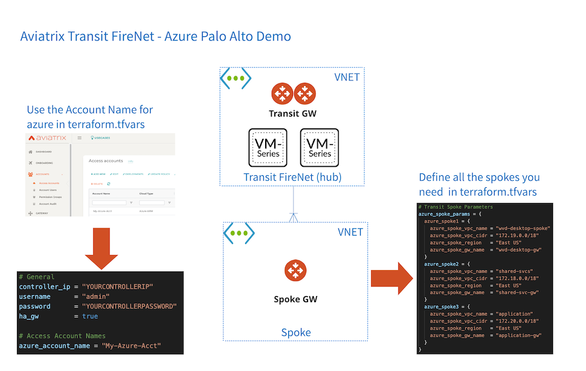

# Azure PAN Transit FireNet Demo

### Summary

This will build out Aviatrix Transit FireNet in Azure 

#### [Aviatrix Module](https://registry.terraform.io/modules/terraform-aviatrix-modules/azure-transit-firenet/aviatrix/1.0.1) used in this demo


### Prerequisites

- Aviatrix Controller available
- Enter your Aviatrix controller_ip, username, password in ```terraform.tfvars.example``` save it as ```terraform.tfvars```
- terraform .12 in your path
- Appropriate Azure limits in target region
- Subscription to PAN in marketplace
- Clone this repository

### Tasks

- Modify ```provider.tf``` to reflect the Aviatrix Terraform Provider version [compatible with your controller](https://registry.terraform.io/providers/AviatrixSystems/aviatrix/latest/docs/guides/release-compatibility). 
- ```terraform init```
- ```terraform plan```
- ```terraform apply --auto-approve```
- To destroy ```terraform destroy --auto-approve```


### What to expect

An Transit FireNet will be created with HA with 3 spokes. Try it out and customize for your needs.

- Observe progress in terminal
- Observe progress in Aviatrix Controller

Check out some other Aviatrix modules [here](https://registry.terraform.io/browse/modules?provider=aviatrix)